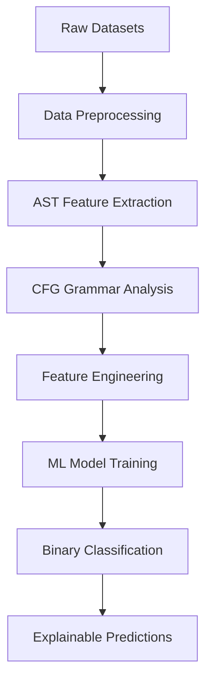

# PromptCodify: Malicious Prompt Detection System


## Overview

PromptCodify is an advanced machine learning system designed to detect malicious prompts using linguistic analysis, Abstract Syntax Trees (AST), and Context-Free Grammar (CFG) features. The system combines natural language processing techniques with explainable AI to provide both accurate classification and interpretable results for cybersecurity applications.

## Key Features

- **Multi-Modal Analysis**: Combines textual, syntactic, and grammatical features
- **AST Generation**: Creates linguistic Abstract Syntax Trees using spaCy
- **CFG Parsing**: Extracts Context-Free Grammar patterns using NLTK
- **Binary Classification**: Random Forest classifier for malicious/benign detection
- **Explainable AI**: Feature importance analysis with prediction confidence
- **Checkpoint System**: Efficient data loading and processing with pickle caching
- **CLI Interface**: Command-line tools with argparse for easy usage

## Architecture



## Project Structure

```
scodeamp/
├── data/
│   ├── jailbreak_prompts.csv         # Jailbreak dataset
│   ├── MPDD.csv                      # Malicious Prompt Detection Dataset
│   ├── unified_dataset.pkl           # Combined dataset checkpoint
│   ├── balanced_dataset_with_features.pkl  # Final ML-ready dataset
│   └── checkpoints/                  # Intermediate processing checkpoints
├── src/
│   ├── 00eda2md.py                   # Exploratory Data Analysis
│   ├── create_unified_dataset.py     # Dataset combination script
│   ├── add_ast_features.py           # AST feature extraction
│   ├── add_cfg_features.py           # CFG grammar analysis
│   ├── create_balanced_ast.py        # Balanced dataset creation
│   └── ml_classifier.py              # ML model and explainability
├── docs/
│   └── promptcodify.md               # Project documentation
└── requirements.txt                  # Python dependencies
```

## Key Python Packages

### Core Data Processing
- **pandas (2.3.2)**: Data manipulation and analysis
- **numpy (2.3.3)**: Numerical operations and array processing
- **pickle**: Data serialization for checkpoint system

### Natural Language Processing
- **spacy (3.8.7)**: Advanced NLP pipeline for AST generation
  - Dependency parsing
  - Part-of-speech tagging
  - Named entity recognition
  - Linguistic feature extraction

- **nltk (3.9.1)**: Natural Language Toolkit for CFG analysis
  - Context-Free Grammar parsing
  - Linguistic rule extraction
  - Text tokenization and analysis

### Machine Learning
- **scikit-learn (1.7.2)**: ML framework
  - Random Forest classifier
  - Feature scaling and preprocessing
  - Model evaluation metrics
  - Train/test splitting

- **scipy (1.16.2)**: Scientific computing support

### Utilities
- **argparse**: Command-line interface
- **pathlib**: File path management
- **collections.Counter**: Feature frequency analysis

## Datasets

### Jailbreak Prompts Dataset
- **Size**: 2,071 prompts
- **Features**: Prompt text, length, perplexity, embeddings
- **Classification**: All treated as malicious
- **Average Length**: 398.5 characters

### MPDD (Malicious Prompt Detection Dataset)
- **Size**: 39,234 prompts
- **Features**: Prompt text, binary malicious label
- **Distribution**: 50% malicious, 50% benign
- **Use Case**: Balanced training data

### Final Dataset
- **Size**: 100 balanced samples (50 malicious, 50 benign)
- **Features**: 21 engineered features from AST/CFG analysis
- **Format**: Ready for ML training and evaluation

## Feature Engineering

### AST Features (spaCy-based)
```python
{
    'tokens': [token.text for token in doc],
    'pos_tags': [token.pos_ for token in doc],
    'dependencies': [(token.text, token.dep_, token.head.text) for token in doc],
    'entities': [(ent.text, ent.label_) for ent in doc.ents],
    'sentences': len(list(doc.sents))
}
```

### CFG Features (NLTK-based)
```python
{
    'rules': ['S -> PROPN PUNCT DET NOUN...', 'NOUN -> "example"'],
    'rule_count': 21,
    'pos_sequence': ['PROPN', 'PUNCT', 'DET', ...],
    'cfg_depth': 10
}
```

### ML Features (21 total)
- **Basic**: length, token_count, sentence_count, entity_count
- **CFG**: cfg_rule_count, cfg_depth
- **POS Tags**: pos_NOUN, pos_VERB, pos_ADJ, pos_PROPN, pos_PRON, pos_ADP, pos_DET, pos_ADV, pos_AUX, pos_NUM
- **Dependencies**: dep_nsubj, dep_dobj, dep_prep, dep_pobj, dep_amod

## Usage

### 1. Environment Setup
```bash
python -m venv .venv-malsr
source .venv-malsr/bin/activate
pip install -r requirements.txt
python -m spacy download en_core_web_sm
```

### 2. Data Processing Pipeline
```bash
# Step 1: Exploratory Data Analysis
python src/00eda2md.py

# Step 2: Create unified dataset
python src/create_unified_dataset.py

# Step 3: Add AST features
python src/add_ast_features.py

# Step 4: Add CFG features  
python src/add_cfg_features.py

# Step 5: Create balanced dataset
python src/create_balanced_ast.py
```

### 3. Machine Learning Classification
```bash
# Basic classification
python src/ml_classifier.py

# With explainability
python src/ml_classifier.py --explain

# Explain specific sample
python src/ml_classifier.py --explain --sample-idx 5
```

## Model Performance

### Classification Results
- **Accuracy**: 83%
- **Precision**: 0.83 (macro avg)
- **Recall**: 0.83 (macro avg)
- **F1-Score**: 0.83 (macro avg)

### Most Important Features
1. **pos_AUX** (0.114): Auxiliary verb frequency
2. **length** (0.108): Prompt character length
3. **token_count** (0.089): Number of tokens
4. **cfg_rule_count** (0.070): CFG complexity
5. **dep_dobj** (0.069): Direct object dependencies

## Explainable AI

The system provides detailed explanations for each prediction:

```
Prediction: malicious
Confidence: 0.980

Top Important Features:
  pos_AUX        :    14.00 (importance: 0.114)
  length         :  3572.00 (importance: 0.108)
  token_count    :   206.00 (importance: 0.089)
  cfg_rule_count :    20.00 (importance: 0.070)
```

## Technical Approach

### AST Generation
Uses spaCy's advanced NLP pipeline to create linguistic Abstract Syntax Trees capturing:
- Syntactic relationships
- Part-of-speech patterns
- Named entity recognition
- Dependency structures

### CFG Analysis
Employs NLTK's grammar parsing to extract Context-Free Grammar rules:
- Production rules from POS sequences
- Terminal symbol mappings
- Grammar complexity metrics
- Structural depth analysis

### Machine Learning
Random Forest classifier chosen for:
- **Interpretability**: Clear feature importance
- **Robustness**: Handles mixed feature types
- **Performance**: Strong baseline accuracy
- **Explainability**: Built-in feature analysis

## Future Enhancements

1. **Advanced Models**: Deep learning approaches (BERT, RoBERTa)
2. **Feature Engineering**: Semantic embeddings, n-gram analysis
3. **Scalability**: Distributed processing for larger datasets
4. **Real-time**: API endpoint for live prompt analysis
5. **Multi-class**: Beyond binary to threat severity classification

## Contributing

1. Fork the repository
2. Create feature branch (`git checkout -b feature/amazing-feature`)
3. Commit changes (`git commit -m 'Add amazing feature'`)
4. Push to branch (`git push origin feature/amazing-feature`)
5. Open Pull Request

## License

This project is licensed under the MIT License - see the [LICENSE](LICENSE) file for details.

## Contact

- **Project**: PromptCodify
- **Repository**: [github.com/username/promptcodify](https://github.com/username/promptcodify)
- **Documentation**: Built with MkDocs and ReadTheDocs

---

*Last Updated: September 2025*